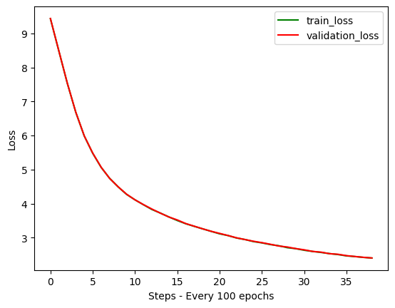
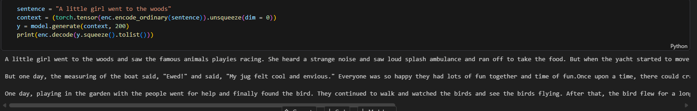
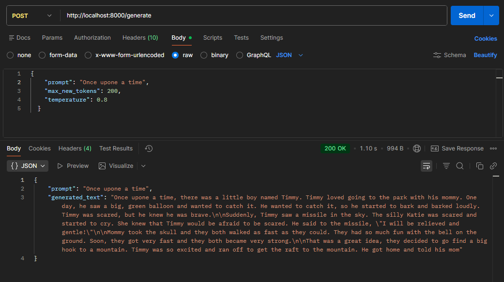

# Custom LLM Built from Scratch


A lightweight **Large Language Model (LLM)** built completely from scratch, trained on **471M Tokens** with a **49M Parameters**.

---

## Overview

This project demonstrates the complete pipeline of building an LLM from scratch, including tokenization, training, and inference.

- Dataset Size: **471 Million Tokens**
- Model Size: **49 Million Parameters**
- Architecture: **Transformer**
- Purpose: **Learning + Experimentation**

---

## 🛠️ Tech Stack

- **Language:** Python 🐍  
- **Framework:** PyTorch  
- **Tokenizer:** tiktoken
- **Data Processing:** NumPy, Pandas  
- **Visualization:** Matplotlib  

---

## Model Details

- Transformer Decoder Architecture  
- Multi-Head Self Attention  
- Positional Encoding  
- Feed Forward Layers  
- Residual Connections & LayerNorm  

---

## Features

- Built completely from scratch  
- Custom tokenizer pipeline  
- Efficient training loop  
- Text generation support  
- Lightweight and fast  

---

## Training Process



- Tokens: **471M**
- Parameters: **49M**
- Optimizer: **Adam / AdamW**
- Loss Function: **CrossEntropyLoss**
- Task: **Next Token Prediction**

---

## Example Output



```txt
Input: "A little girl went to the woods"
Output: "A little girl went to the woods and saw the famous animals playies racing. She heard a strange noise and saw loud splash ambulance and ran off to take the food. But when the yacht started to move she could not fit so well that the animals couldn't see her. Soon, the ants would catch all around the house for it, but they didn't want him.

But one day, the measuring of the boat said, "Ewed!" and said, "My jug felt cool and envious." Everyone was so happy they had lots of fun together and time of fun.Once upon a time, there could crashing and soaking up all the bees lived in a tall tree. Every night, where the sea would kept all the bees by and cuddled like how the bird did. 

One day, playing in th"

---

## Build Api in fastapi



